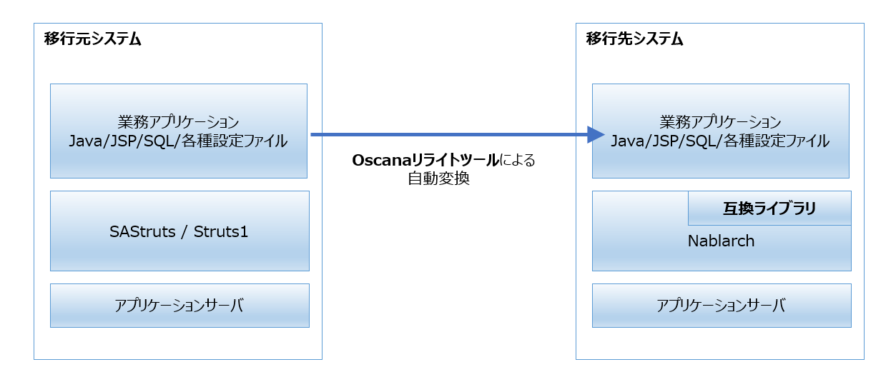

# Oscana: SAStruts/Struts1からNablarchへのマイグレーションツール

## Oscanaとは

**Oscana（オスカーナ）** は、EOLを迎えた[SAStruts](http://sastruts.seasar.org/)や[Struts1](https://struts.apache.org/struts1eol-announcement.html)を使用したアプリケーションを、長期的に利用可能なOSSフレームワークである[Nablarch](http://nablarch.github.io/)を使用したアプリケーションにマイグレーションするツールです。 

Javaのソースコードだけでなく、JSP、SQLファイルや各種設定ファイルも含めた業務アプリケーションの大部分を自動で変換することにより、マイグレーションにおける開発作業にかかる工数を大幅に削減することができます。 

EOLを迎えたSAStruts、Struts1は脆弱性への対応が停止しているため、これらの継続利用はセキュリティ上のリスクを伴う可能性があります。Oscanaは、これらのフレームワークを利用するアプリケーションを、安全でモダンなフレームワークであるNablarchのアプリケーションへと自動変換することで、このリスクを迅速に解消します。 

<table border="0.5">
<tr><td>
<b>Nablarchについて</b> 
Oscanaによる移行先となるNablarchは、Webアプリケーションの開発／実行基盤として、金融・クレジットカード業界におけるTISのナレッジを凝縮し、ミッションクリティカルな基幹系システムに必要な機能を揃えた独自Javaアプリケーションフレームワークです。 
長期間使い続けることができるため、移行後は、EOL起因によるアプリケーションフレームワークのマイグレーションの心配がなくなります。 
また、NablarchはOSSであるため、ベンダロックインとなることもありません。
</td></tr>
</table>

### コンセプト 

Oscanaにおけるマイグレーションは、業務アプリケーションのうち、移行元フレームワーク(SAStruts/Struts1)に依存する部位だけを、移行先フレームワーク(Nablarch)に依存する形式にリライトする方式を採用しています。 
このアプローチは、既存コードの再利用性を高め、機能の移植漏れや仕様不一致などの不具合が起こりにくく、安全・確実にマイグレーションを完遂させることができます。

Oscanaが提供するリライトツールは、コード解析・変換技術を活用することで依存個所の大半を自動検出し、変換することができます。 
通常、機械的なリライトを行うと、互換性のための冗長なコードが大量に埋め込まれ、リライト後のメンテナンス性が低下しますが、Oscanaでは、変換元フレームワークの機能をエミュレートする互換ライブラリを提供することで、冗長なコードの生成を抑止しています。

### リライトツール

リライトツールは移行元フレームワークに依存するアプリケーションコードを、Nablarch形式に自動変換するツールです。 

**[リライトツールの主な変換対象]**
  * Java
    * *Action* - インタフェースやアノテーションをNablarch形式にリライトする。
    * *Form* - バリデーションアノテーションをNablarchのバリデーションアノテーションにリライトする。
    * *Service* - DBアクセス処理をNablarchの[UniversalDao](https://nablarch.github.io/docs/LATEST/doc/application_framework/application_framework/libraries/database/universal_dao.html)形式にリライトする。
    * *Entity* - DBMSとのマッピング情報となるアノテーションをNablarchのUniversalDao形式にリライトする。
  * JSP
    * *JSP* - カスタムタグをNablarchのカスタムタグにリライトする。
  * 設定ファイル
    * *SQLファイル* - S2JDBCの制御構文をNablarch仕様の制御構文にリライトする。
    * *struts-config.xml* - 画面遷移情報をAction内のJavaコードにリライトする。
    * *validation.xml* - バリデーション情報をForm内のバリデーションアノテーションにリライトする。

### 互換ライブラリ

互換ライブラリは移行元フレームワークの機能をNablarch上で再現させるものです。 
互換ライブラリをNablarchにプラグインすることで、旧フレームワークに依存したコードがそのまま、もしくは、小さな修正だけで動作するようになります。 

**[互換ライブラリの主な内容]** 
  * *Java互換API* - 旧フレームワークにあるAPIをNablarchに移植したもの。
  * *イベントハンドラアダプタ* - 旧フレームワークで呼び出されるイベントハンドラをNablarchからも呼び出されるようにしたもの。
  * *バリデータ* - 旧フレームワークにあるバリデーションをNablarchに移植したもの。
  * *SQLコンバータ* - S2JDBCの制御構文をNablarch上で実行するSQLコンバータ。
  * *メッセージフィルタ* - 旧フレームワーク形式のメッセージをNablarchでも使用できるようにするフィルタ。

## はじめてみよう - Getting Started

簡単なアプリケーションを変換し、動かしてみることを通じて、Oscanaを用いたマイグレーションの考え方を紹介したコンテンツです。 

リライトツールを用いてアプリケーションを変換し、お使いのPC上に構築したNablarch上で動作確認するまでの手順を記載しています。 

本コンテンツでは、SAStruts,Struts1それぞれのExampleをベースにしたサンプルアプリケーションを変換元として提供しています。これらのサンプルは、変換後の手作業による修正がほぼ不要です。簡単な手順にて一連の開発の流れを体験することができます。

１．[リライトツールをインストールする](https://github.com/oscana/oscana-s2n/blob/master/doc/getting_started/tool_install.md) 
２．[互換ライブラリをインストールする](https://github.com/oscana/oscana-s2n/blob/master/doc/getting_started/runtime_install.md) 
３．[サンプルアプリケーションを変換する(Struts1)](https://github.com/oscana/oscana-s2n/blob/master/doc/getting_started/sample_change_struts.md) 
４．[サンプルアプリケーションを変換する(SAStruts)](https://github.com/oscana/oscana-s2n/blob/master/doc/getting_started/sample_change_sastruts.md) 

## 活用ガイド

Oscanaを用いたマイグレーションの進め方をより深く解説したコンテンツです。 アプリケーションを変換する方法と、コンパイル結果やソース上の注釈コメントなどから、開発作業が必要な個所を見つける方法を記載しています。

１．[アプリケーションを変換する](https://github.com/oscana/oscana-s2n/blob/master/doc/rebuild_guide/users_guide.md) 
２．[開発作業が必要な個所を見つける](https://github.com/oscana/oscana-s2n/blob/master/doc/rebuild_guide/rebuild_guide.md)

## リファレンス

Oscanaによるマイグレーションにより、アプリケーションが使用していた旧フレームワーク(SAStruts, Struts1)の機能はNablarchの類似する機能に置き換えられます。 
このコンテンツでは、カスタムタグ、バリデーション、APIの新旧対応表、互換ライブラリのJavadocを提供します。

  * [カスタムタグ変換リファレンス](https://github.com/oscana/oscana-s2n/blob/master/doc/reference/customtag_conversion_reference.pdf) 
  * [バリデーション変換リファレンス](https://github.com/oscana/oscana-s2n/blob/master/doc/reference/validation_conversion_reference.pdf) 
  * [新旧API対応表](https://github.com/oscana/oscana-s2n/blob/master/doc/reference/api_conversion_reference.pdf) 
  * 互換ライブラリのJavadoc([Struts](https://oscana.github.io/javadoc/oscana-s2n-runtime-struts), [SAStruts](https://oscana.github.io/javadoc/oscana-s2n-runtime-sastruts))

## ライセンス

  * Oscanaのソースコードのライセンスは[Apache License 2.0](https://fintan.jp/wp-content/uploads/2018/06/LICENSE.txt) に準拠しています。 
  * 本文書も含め、ドキュメントのライセンスは[クリエイティブコモンズ(Creative Commons) 4.0 の「表示—継承」](https://creativecommons.org/licenses/by-sa/4.0/)に準拠しています。

※ 記載されている会社名、製品名は、各社の登録商標または商標です。
