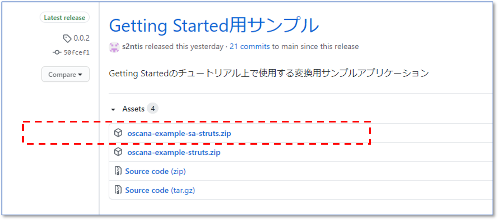

## サンプルアプリケーションを変換する(SAStruts)

本書では「[リライトツールをインストールする](tool_install.md)」でインストールしたツールを用いて、サンプルアプリケーションを変換し、変換結果を「[互換ライブラリをインストールする](runtime_install.md)」で構築したNablarchプロジェクトにコピーして動作を確認します。

#### ファイル修正箇所の記述ルール

設定ファイルの修正方法は以下の記述ルールに従って表示しています。

```diff
+ このように、行頭に＋(プラス)記号が付与されている行が追記すべき内容です。実際のファイル修正時には、行頭の+記号は不要です。
- このように、行頭に－(マイナス)記号が付与されている行が削除すべき内容です。
```

ファイルの例は実際のファイルと異なる場合があります。その場合、追記個所の前後関係を参考に修正してください。


## 1.サンプルアプリケーションのダウンロード

サンプルアプリケーションはzipファイルとして配布しています。<br>
以下から最新のzipファイルをダウンロードし、任意の場所に展開してください。

**[サンプルアプリケーション公開場所]**

[https://github.com/oscana/oscana-s2n/releases](https://github.com/oscana/oscana-s2n/releases)

**[zipファイルの探し方]**

リリースリストから最新の「Getting Started用サンプル」を選択し、Assetsセクションにある`oscana-example-sa-struts.zip`をダウンロードしてください。



※お使いのブラウザの種類やGitHub自体のUI変更などにより、上記UIとは異なる場合があります。（上記はWindows 10 Edgeの場合)<br>
※`oscana-example-sa-struts.zip`に付与されているバージョン番号は更新されるので画像とは異なる場合があります。


## 2.リライトツールによる変換

### 2.1 リライトツールへの変換対象の配置

ダウンロードしたzipファイルを展開し、そこからリライトツールに変換対象をコピーしてください。

|種類| コピー元(zipファイル内のパス) | コピー先(リライトツール) | 備考 |
|--|--|--|--|
|javaソース |oscana-example-sa-struts/src/main/java/   | converter/work/java/from/ |`oscana-example-sa-struts/src/main/java/`配下のファイル・ディレクトリをすべてコピーしてください。|
|jspソース | oscana-example-sa-struts/src/main/webapp/WEB-INF/view/ | converter/work/jsp/from/ |`oscana-example-sa-struts/src/main/webapp/WEB-INF/view/`配下のファイル・ディレクトリをすべてコピーしてください。|


### 2.2 リライトツールの設定変更

以下の場所にあるリライトツールの設定ファイルを修正してください。

- 修正対象：`converter/sample.properties`

|項目| 意味 | デフォルト値 |設定値|
|--|--|--|--|
|projectPath | リライトツールの作業対象パス | work/  | （修正不要） |
| basePackage |変換対象アプリケーションのBaseパッケージ  |com.example| tutorial |
| savePathForRoutexml | routes.xmlの出力先 | work/routes.xml  | （修正不要）  |
| fileEncoding | ソースファイルの文字コード | UTF-8  | （修正不要）  |
| strutsAnalyze.strutsConfigFile| Struts1用の設定項目 |（なし）| （修正不要）   |
| strutsAnalyze.validationFile| Struts1用の設定項目 |（なし）| （修正不要）   |
| strutsAnalyze.module| Struts1用の設定項目 |（なし）| （修正不要）   |
| convertMode| 変換元アプリケーションの利用フレームワーク(1...Struts、2...SAStruts)| 2  |（修正不要） |


### 2.3 リライトツールの実行

リライトツールのホームディレクトリ上でjavaコンバータ、jspコンバータを順に実行してください。

```
java -jar javaconverter.jar sample.properties
java -jar jspconverter.jar sample.properties
```

### 2.4 ソースコードの修正

SAStruts用サンプルアプリケーションは変換後の修正が不要です。

## 3.変換後アプリケーションの動作確認

変換後アプリケーションの動作確認を行います。動作確認には、Webアプリケーションをローカルで動作させることができるMavenプラグイン [waitt-maven-plugin](https://github.com/kawasima/waitt/tree/master/waitt-maven-plugin) を使用します。

### 3.1 変換結果のNablarchプロジェクトへの配置

変換結果を「[互換ライブラリをインストールする](runtime_install.md)」の手順で作成したmyapp-webにコピーしてください。

|種類| コピー元(リライトツール） | コピー先(myapp-web) | 備考 |
|--|--|--|--|
|javaソース |converter/work/java/to/   | myapp-web/src/main/java/ |`converter/work/java/to/`配下のファイル・ディレクトリをすべてコピーしてください。|
|jspソース | converter/work/jsp/to/ | myapp-web/src/main/webapp/WEB-INF/view/ |`converter/work/jsp/to/`配下のファイル・ディレクトリをすべてコピーしてください。|
|routes.xml| converter/work/routes.xml| myapp-web/src/main/resources/ |`routes.xml`だけをコピーしてください。|


### 3.2 SAStruts用互換ライブラリを使用するための設定修正

「[互換ライブラリをインストールする](runtime_install.md)」や「[サンプルアプリケーションを変換する(Struts1)](sample_change_struts.md)」を実施した直後は、NablarchプロジェクトはStruts1用互換ライブラリを使うように設定されているので、この手順を実行してください。<br>

#### ■pom.xmlの修正

- 修正対象：`myapp-web/pom.xml`

pomにSAStruts用の記述を追加してください。


```diff
     <!-- 互換ライブラリ-->
+    <dependency>
+      <groupId>com.github.oscana</groupId>
+      <artifactId>oscana-s2n-runtime-sastruts</artifactId>
+      <version>1.0.0</version>
+    </dependency>
     <dependency>
       <groupId>com.github.oscana</groupId>
       <artifactId>oscana-s2n-runtime-struts</artifactId>
       <version>1.0.0</version>
     </dependency>
```

#### ■S2N_Component.xmlの差し替え

- 修正対象:`myapp-web/src/main/resources/S2N_Component.xml`

以下からダウンロードした`S2N_Component.xml`で、修正対象を上書きしてください。<br>

[S2N_Component.xml](https://github.com/oscana/oscana-s2n-runtime-sastruts/blob/master/default-config/S2N_Component.xml)


### 3.3 設定ファイルの修正

アプリケーション固有の設定を行います。

#### ■web.xmlへの追記

 - 修正対象:`myapp-web/src/main/webapp/WEB-INF/web.xml`

filter-mapping要素の既存パスを削除し、アプリケーション固有のリクエストパスを追記してください。

```diff
<filter-mapping>
  ...
-   <url-pattern>/action/*</url-pattern>
-   <url-pattern>/</url-pattern>
+   <url-pattern>/add/*</url-pattern>
+   <url-pattern>/download/*</url-pattern>
+   <url-pattern>/index/*</url-pattern>
+   <url-pattern>/upload/*</url-pattern>
+   <url-pattern>/validator/*</url-pattern>
  ...
</filter-mapping>
```


#### ■common.configへのベースパッケージの追記

 - 修正対象:`myapp-web/src/main/resources/common.config`

nablarch.commonProperty.basePackage要素を以下のように修正してください。

```diff
 # プロジェクトのベースパッケージ
-nablarch.commonProperty.basePackage=com.example
+nablarch.commonProperty.basePackage=tutorial.action
```

#### ■messages.propertiesへアプリケーション用メッセージの追記

 - 修正対象:`myapp-web/src/main/resources/messages.properties`

下記のアプリケーション固有のメッセージを追記してください。
```diff
+byteText.label=バイト
+shortText.label=短整数
+integerText.label=整数
+longText.label=長整数
+floatText.label=短精度実数
+doubleText.label=長精度実数
+dateText.label=日付
+creditcardText.label=クレジットカード
+emailText.label=メールアドレス
+urlText.label=URL
+intRangeText.label=整数(3～10)
+longRangeText.label=長整数(3～10)
+floatRangeText.label=短精度実数(3.0～10.0)
+doubleRangeText.label=倍精度実数(3.0～10.0)
+minlengthText.label=文字列の長さの最小値が3
+maxlengthText.label=文字列の長さの最大値が10
+minbytelengthText.label=文字列のバイト長の最小値が3
+maxbytelengthText.label=文字列のバイト長の最大値が10
+phoneText.label=電話番号
+formFile1.label=ファイル1
+arg1.label=数字1
+arg2.label=数字2

```

### 3.4 画面表示用ファイルの配置

「[1.サンプルアプリケーションのダウンロード](#1サンプルアプリケーションのダウンロード)」でダウンロードしたzipファイルから画面表示に必要なファイルをmyapp-webにコピーしてください。

|種類| コピー元(zipファイル内のパス） | コピー先(myapp-web) | 備考 |
|--|--|--|--|
|htmlファイル |oscana-example-sa-struts/src/main/webapp/   | myapp-web/src/main/webapp/ |`index.html`だけをコピーしてください。|

### 3.5 アプリケーションのビルド

Nablarchのブランクプロジェクトのホームディレクトリ上で、以下のコマンドを順に実行し、アプリケーションをビルドしてください。<br>
いずれも `BUILD SUCCESS`となれば成功です。

```
mvn clean
mvn compile
```


### 3.6 アプリケーションの実行

Nablarchのブランクプロジェクトのホームディレクトリ上で、以下のコマンドを実行し、アプリケーションを実行してください。<br>
`BUILD SUCCESS`となり、Webブラウザが起動して画面が表示されれば成功です。

```
mvn waitt:run
```

**[画面イメージ]**


