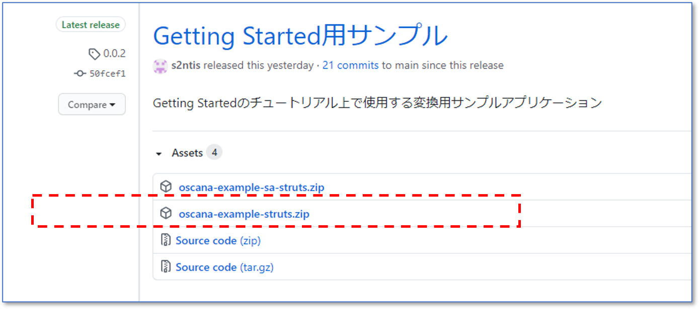

## サンプルアプリケーションを変換する(Struts1)

本書では「[リライトツールをインストールする](tool_install.md)」でインストールしたツールを用いて、サンプルアプリケーションを変換し、変換結果を「[互換ライブラリをインストールする](runtime_install.md)」で構築したNablarchプロジェクトにコピーして動作を確認します。


#### ファイル修正箇所の記述ルール

設定ファイルの修正方法は以下の記述ルールに従って表示しています。

```diff
+ このように、行頭に＋(プラス)記号が付与されている行が追記すべき内容です。実際のファイル修正時には、行頭の+記号は不要です。
- このように、行頭に－(マイナス)記号が付与されている行が削除すべき内容です。
```

ファイルの例は実際のファイルと異なる場合があります。その場合、追記個所の前後関係を参考に修正してください。


## 1.サンプルアプリケーションのダウンロード

サンプルアプリケーションはzipファイルとして配布しています。<br>
以下から最新のzipファイルをダウンロードし、任意の場所に展開してください。

**[サンプルアプリケーション公開場所]**

[https://github.com/oscana/oscana-s2n/releases](https://github.com/oscana/oscana-s2n/releases)

**[zipファイルの探し方]**

リリースリストから最新の「Getting Started用サンプル」を選択し、Assetsセクションにある`oscana-example-struts.zip`をダウンロードしてください。



※お使いのブラウザの種類やGitHub自体のUI変更などにより、上記UIとは異なる場合があります。（上記はWindows 10 Edgeの場合)<br>
※`oscana-example-struts.zip`に付与されているバージョン番号は更新されるので画像とは異なる場合があります。


## 2.リライトツールによる変換

### 2.1 リライトツールへの変換対象の配置

ダウンロードしたzipファイルを展開し、そこからリライトツールに変換対象をコピーしてください。

|種類| コピー元(zipファイル内のパス) | コピー先(リライトツール) | 備考 |
|--|--|--|--|
|javaソース |oscana-example-struts/WEB-INF/src/java/   | converter/work/java/from/ |`oscana-example-struts/WEB-INF/src/java/`配下のファイルをすべてコピーしてください。|
|jspソース | oscana-example-struts/ | converter/work/jsp/from/ |`oscana-example-struts/`配下の`*.jsp`ファイルだけをコピーしてください。(対象ファイルが存在しないディレクトリに対する空ディレクトリ作成は不要です)|
|設定| oscana-example-struts/WEB-INF/ | converter/work/conf/from/ |`oscana-example-struts/WEB-INF/`配下の`struts-config.xml`、`validation.xml`だけをコピーしてください。(対象ファイルが存在しないディレクトリに対する空ディレクトリ作成は不要です)|


### 2.2 リライトツールの設定変更

以下の場所にあるリライトツールの設定ファイルを修正してください。

- 修正対象：`converter/sample.properties`

|項目| 意味 | デフォルト値 |設定値|
|--|--|--|--|
|projectPath | リライトツールの作業対象パス | work/  | （修正不要） |
| basePackage |変換対象アプリケーションのBaseパッケージ  |com.example| org.apache.struts.webapp |
| savePathForRoutexml | routes.xmlの出力先 | work/routes.xml  | （修正不要）  |
| fileEncoding | ソースファイルの文字コード | UTF-8  | （修正不要）  |
| strutsAnalyze.strutsConfigFile| struts-config.xml（複数指定可） |（なし）| conf/from/struts-config.xml,conf/from/validator/struts-config.xml,conf/from/upload/struts-config.xml  |
| strutsAnalyze.validationFile| validation.xml（複数指定可） |（なし）| ,conf/from/validator/validation.xml,conf/from/upload/validation.xml  |
| strutsAnalyze.module| struts-config.xmlに付与しているmodule名（複数指定可） |（なし）| ,validator,upload  |
| convertMode| 変換元アプリケーションの利用フレームワーク(1...Struts、2...SAStruts)| 2  | 1|

※strutsAnalyze.validationFile、strutsAnalyze.moduleの設定値は先頭がカンマで始まります。先頭のカンマが漏れないようにご注意ください。


### 2.3 リライトツールの実行

リライトツールのホームディレクトリ上でjavaコンバータ、jspコンバータを順に実行してください。

```
java -jar javaconverter.jar sample.properties
java -jar jspconverter.jar sample.properties
```


### 2.4 ソースコードの修正

以下のソースを修正してください。

- 修正対象：`converter/work/java/to/java/org/apache/struts/webapp/validator/RegistrationForm.java`


```diff
    @Required
    @Pattern(regexp = "^\\w+$")
    @Length(min = 5)
+   @FieldName(value = "registrationForm.firstname.displayname")
    public String getFirstName() {
        return firstName;
    }
    ．．．
    @Required
    @Pattern(regexp = "^[a-zA-Z]*$")
    @Length(max = 10)
+   @FieldName(value = "registrationForm.lastname.displayname")
    public String getLastName() {
        return lastName;
    }
    ．．．
    @Required
+   @FieldName(value = "registrationForm.addr.displayname")
    public String getAddr() {
        return addr;
    }
    ．．．
    @Pattern(regexp = "^\\(?(\\d{3})\\)?[-| ]?(\\d{3})[-| ]?(\\d{4})$")
+   @FieldName(value = "registrationForm.phone.displayname")
    public String getPhone() {
        return phone;
    }
    ．．．
    @Required
    @Email
+   @FieldName(value = "registrationForm.email.displayname")
    public String getEmail() {
        return email;
    }

```


## 3.変換後アプリケーションの動作確認

変換後アプリケーションの動作確認を行います。動作確認には、Webアプリケーションをローカルで動作させることができるMavenプラグイン [waitt-maven-plugin](https://github.com/kawasima/waitt/tree/master/waitt-maven-plugin) を使用します。


### 3.1 変換結果のNablarchプロジェクトへの配置

変換結果を「[互換ライブラリをインストールする](runtime_install.md)」の手順で作成したmyapp-webにコピーしてください。

|種類| コピー元(リライトツール） | コピー先(myapp-web) | 備考 |
|--|--|--|--|
|javaソース |converter/work/java/to/java/   | myapp-web/src/main/java/ |`converter/work/java/to/java/`配下のファイルをすべてコピーしてください。|
|jspソース | converter/work/jsp/to/ | myapp-web/src/main/webapp/WEB-INF/view/ |`converter/work/jsp/to/`配下のファイルをすべてコピーしてください。|
|routes.xml| converter/work/routes.xml| myapp-web/src/main/resources/ |`routes.xml`だけコピーしてください。|


### 3.2 Struts1用互換ライブラリを使用するための設定修正

「[互換ライブラリをインストールする](runtime_install.md)」を実施した直後であれば、すでにNablarchプロジェクトはStruts1用互換ライブラリを使うように設定されているので、この手順はスキップしてください。<br>

「[サンプルアプリケーションを変換する(SAStruts)](sample_change_sastruts.md)」を実施するなどして、NablarchプロジェクトがSAStruts用互換ライブラリを使うように設定されている場合は、この手順を実施してください。<br>


#### ■pom.xmlの修正

- 修正対象：`myapp-web/pom.xml`

pomに含まれるSAStruts用の記述を削除してください。


```diff
     <!-- 互換ライブラリ-->
-    <dependency>
-      <groupId>com.github.oscana</groupId>
-      <artifactId>oscana-s2n-runtime-sastruts</artifactId>
-      <version>1.0.0</version>
-    </dependency>
     <dependency>
       <groupId>com.github.oscana</groupId>
       <artifactId>oscana-s2n-runtime-struts</artifactId>
       <version>1.0.0</version>
     </dependency>
```

#### ■S2N_Component.xmlの差し替え

- 修正対象:`myapp-web/src/main/resources/S2N_Component.xml`

以下からダウンロードした`S2N_Component.xml`で、修正対象を上書きしてください。<br>

[S2N_Component.xml](https://github.com/oscana/oscana-s2n-runtime-struts/blob/master/default-config/S2N_Component.xml)


### 3.3 設定ファイルの修正

アプリケーション固有の設定を行います。

#### ■web.xmlへの追記

 - 修正対象:`myapp-web/src/main/webapp/WEB-INF/web.xml`

filter-mapping要素の既存パスを削除し、アプリケーション固有のリクエストパスを追記してください。

```diff
<filter-mapping>
  ...
-   <url-pattern>/action/*</url-pattern>
-   <url-pattern>/</url-pattern>
+   <url-pattern>/validator/registration-submit.do</url-pattern>
+   <url-pattern>/upload/upload-submit.do</url-pattern>
  ...
</filter-mapping>
```


#### ■common.configへのベースパッケージの追記

 - 修正対象:`myapp-web/src/main/resources/common.config`

nablarch.commonProperty.basePackage要素を以下のように修正してください。

```diff
 # プロジェクトのベースパッケージ
-nablarch.commonProperty.basePackage=com.example
+nablarch.commonProperty.basePackage=org.apache.struts.webapp
```

#### ■messages.propertiesへアプリケーション用メッセージの追記

 - 修正対象:`myapp-web/src/main/resources/messages.properties`

下記のアプリケーション固有のメッセージを追記してください。
```diff
+# Index Page
+index.title=Struts Validator
+index.power=Powered by Struts
+# Registration Form
+registrationForm.title=登録フォーム
+registrationForm.title.create=登録者
+registrationForm.title.edit=ユーザ情報を編集
+registrationForm.firstname.displayname=名(FirstName)
+registrationForm.lastname.displayname=姓(LastName)
+registrationForm.addr.displayname=住所（番地）
+registrationForm.city.displayname=住所（市町村）
+registrationForm.stateprov.displayname=住所（都道府県）
+registrationForm.zippostal.displayname=郵便番号
+registrationForm.phone.displayname=電話番号（固定でも携帯でも可）
+registrationForm.email.displayname=メールアドレス
+registrationForm.lastname.maskmsg=姓には空白を含めることはできません

+button.cancel=Cancel
+button.confirm=Confirm
+button.reset=Reset
+button.save=Save

+# Upload Form
+uploadForm.theText=TheText

+# Header Errors
+errors.footer=
+errors.header=入力チェックエラーが発生しました。

```

### 3.4 アプリケーションのビルド

Nablarchのブランクプロジェクトのホームディレクトリ上で、以下のコマンドを順に実行し、アプリケーションをビルドしてください。<br>
いずれも `BUILD SUCCESS`となれば成功です。

```
mvn clean
mvn compile
```


### 3.5 アプリケーションの実行

Nablarchのブランクプロジェクトのホームディレクトリ上で、以下のコマンドを実行し、アプリケーションを実行してください。<br>
`BUILD SUCCESS`となり、Webブラウザが起動して画面が表示されれば成功です。

```
mvn waitt:run
```

