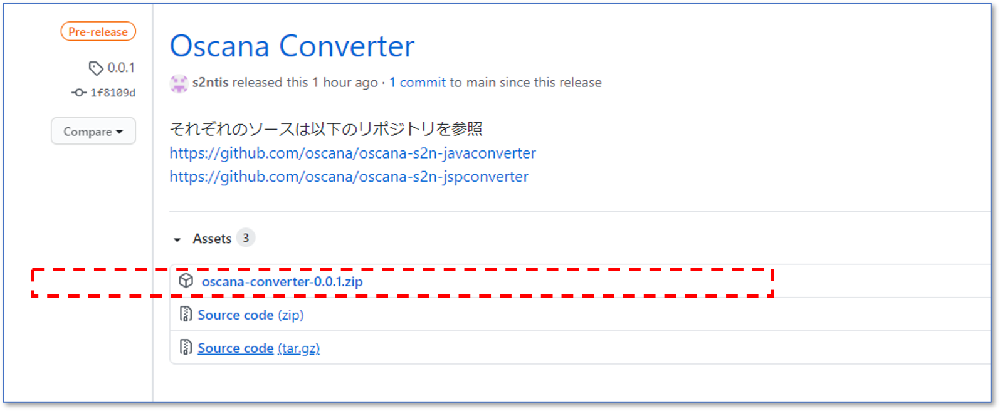

# リライトツールをインストールする

本書ではお使いのPCにリライトツールをインストールする手順を案内します。

## 環境

本ツールを実行するには、Java Runtime Environment バージョン8 以上が必要です。


## 1.ダウンロード

リライトツールはzipファイルとして配布しています。ダウンロード後、展開するだけで利用可能です。
以下の場所から最新のzipファイルをダウンロードし、任意の場所に展開してください。

**[リライトツールバイナリ公開場所]**

[https://github.com/oscana/oscana-s2n/releases](https://github.com/oscana/oscana-s2n/releases)

**[zipファイルの探し方]**

リリースリストから最新のOscana Converterを選択し、Assetsセクションにある`oscana-converter.zip`をダウンロードしてください。



※お使いのブラウザの種類やGitHub自体のUI変更などにより、上記UIとは異なる場合があります。（上記はWindows 10 Edgeの場合)<br>
※`oscana-converter.zip`に付与されているバージョン番号は更新されるので画像とは異なる場合があります。


## 2.展開

ダウンロードした`oscana-converter.zip`を展開すると以下のファイルとディレクトリが作成されます。

| ファイル・ディレクトリ | 説明 |
| ------------- | ------------ |
| converter/javaconverter.jar | javaコンバータ実行ファイル |
| converter/jspconverter.jar | jspコンバータ実行ファイル |
| converter/sample.properties | デフォルト設定ファイル |
| converter/converter/logs | コンバータの実行結果のログの出力先 |
| converter/converter/work | 変換作業ディレクトリ（変換元ソース格納場所、変換先ソース出力場所） |

展開して作成された`converter`はリライトツールのホームディレクトリとなります。

## 3.実行

リライトツールのホームディレクトリ上で`javaconverter.jar`、`jspconverter.jar`を実行し、以下のように表示されればインストールは成功しています。

```
java -jar javaconverter.jar
usage:java -jar javaconverter.jar [設定ファイル]
```


```
java -jar jspconverter.jar
usage:java -jar jspconverter.jar [設定ファイル]
```


